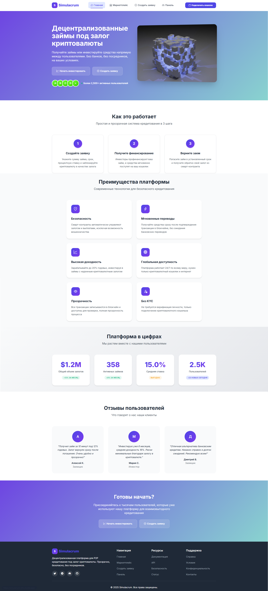
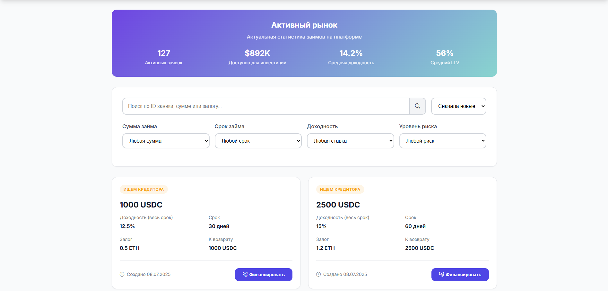
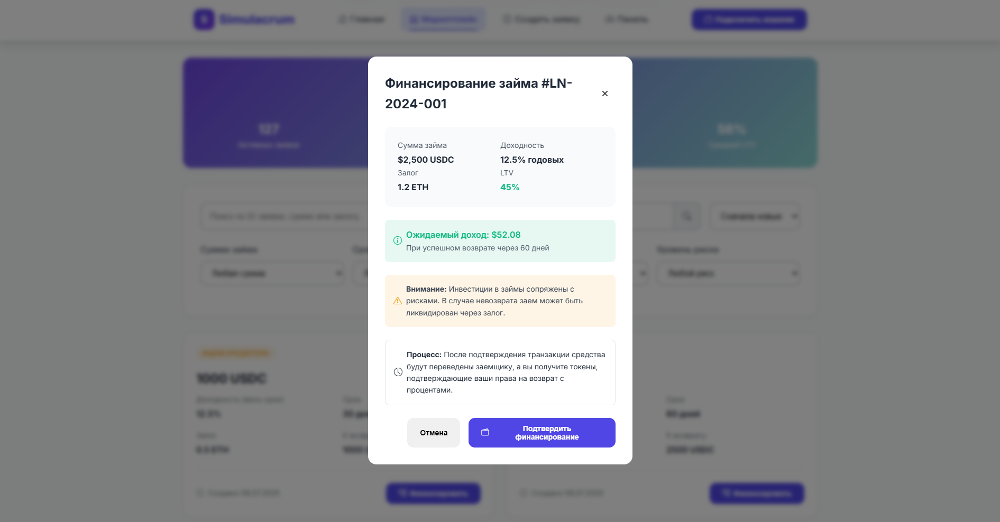
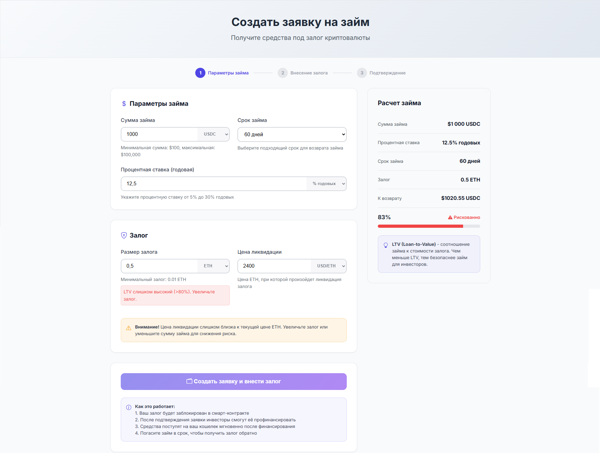
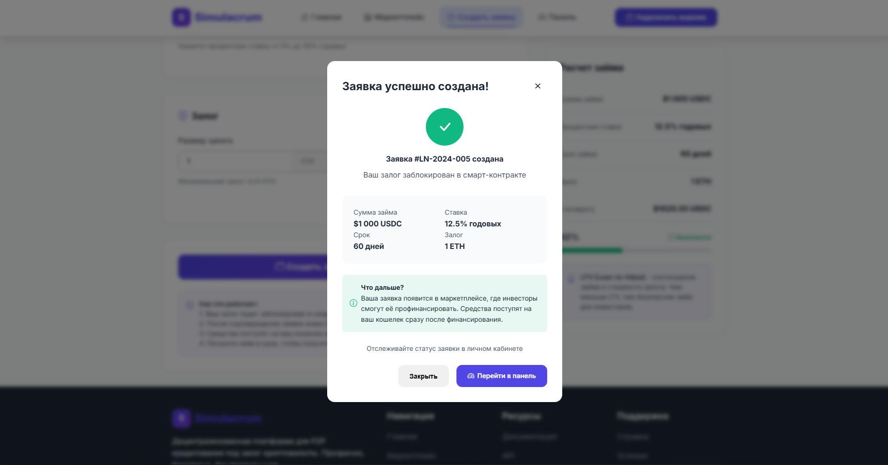
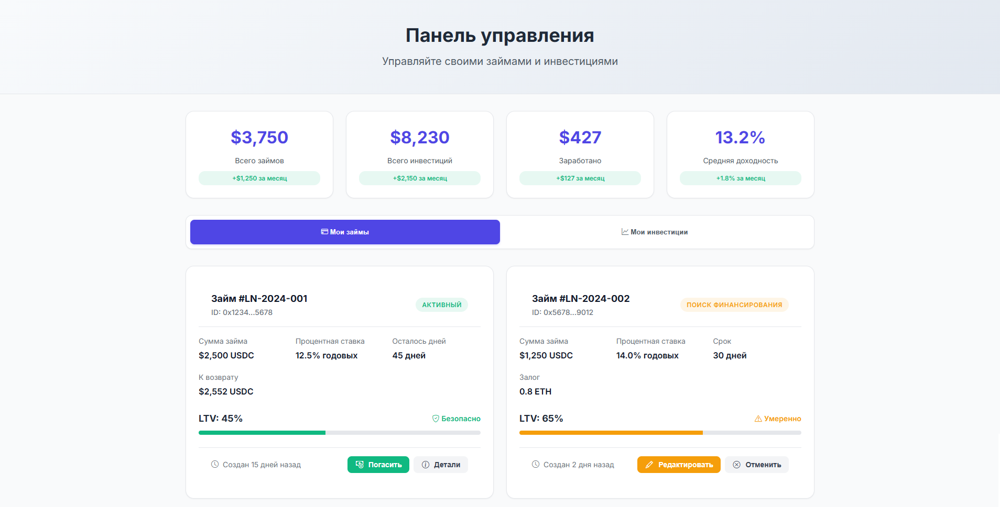

# Simulacrum

`Simulacrum` is a decentralized peer-to-peer lending platform
that simplifies the process of lending and receiving loans between users without intermediaries.

## Website interface

Main page:

Marketplace page:

"Create loan" page:

Dashboard page:

## Running the project

To run our project on your local machine, you will need to:
1. [Install Rust](https://www.rust-lang.org/tools/install)
2. [Install `shuttle-rs`](https://www.shuttle.dev/) (`cargo install cargo-shuttle`)
3. Run the project with `shuttle run`
   (automatic compilation of the project, setting up configuration files, deploying the website to localhost).
4. Deploy our contract to the testnet of your choice and configure that in our frontend.

## Note
This project was developed as part of a hackathon in a short time frame and,
as a result, the written code is subject to technical debt and clogging.

Connection with the actual testnet may not be working on the frontend, but is theoretically available
for any blockchain network to which our contract is deployed.

However, the presented project is viable even in this state, and therefore may be an object of interest.
